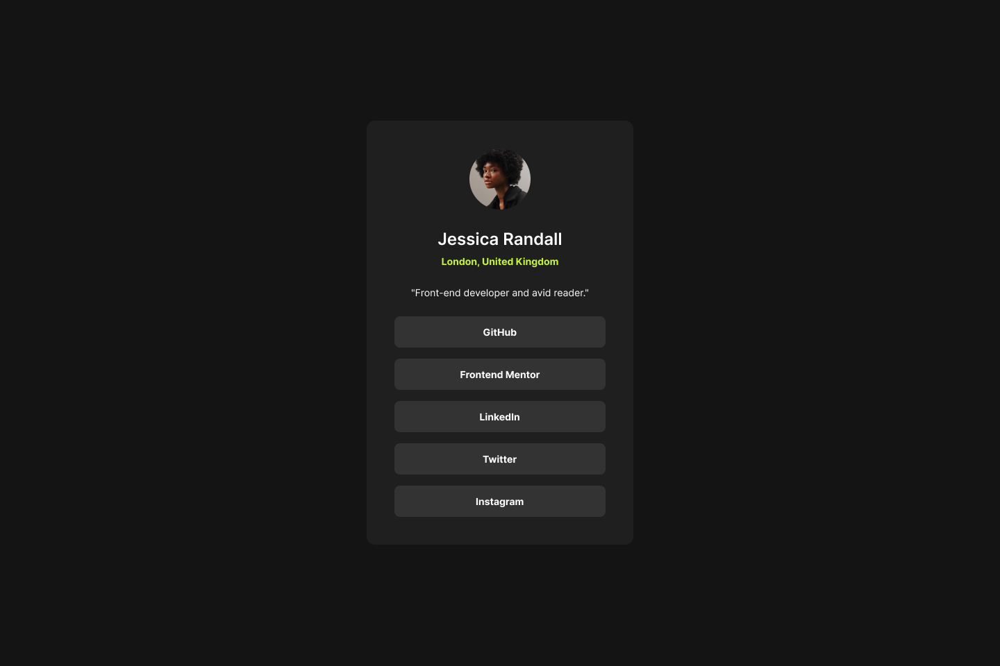

# Frontend Mentor - Social links profile solution

This is a solution to the [Social links profile challenge on Frontend Mentor](https://www.frontendmentor.io/challenges/social-links-profile-UG32l9m6dQ). Frontend Mentor challenges help you improve your coding skills by building realistic projects. 

## The challenge

Users should be able to:

- [x] See hover and focus states for all interactive elements on the page

## Screenshot

## Links

- [Solution URL](https://your-solution-url.com)
- [Live Site URL](https://meelix.github.io/frontendmentor-social-links)

## Built with

- Native css nesting
- Css grid & flex